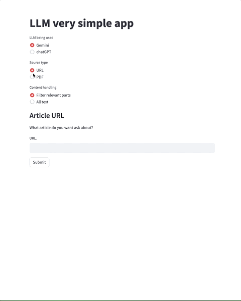

# Simple app using LLM
A LLM 101 Proof of Concept

* Ask questions about a specific given content;
* RAG
  * Passing all content in the prompt;
  * Filtering content using embeddings in vector store;
* Source type
  * URL;
  * PDF;
* LLM model
  * Google Gemini;
  * OpenAI GPT 3.5.

Contributions, thoughts, comments are welcome.

---

  

---

Python 3.11 required.

